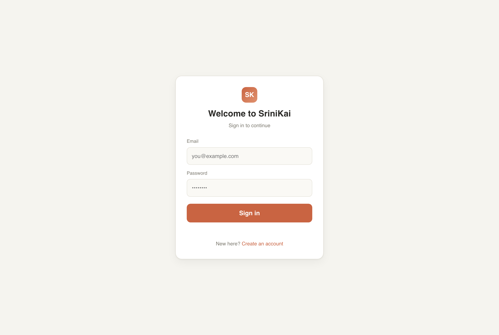
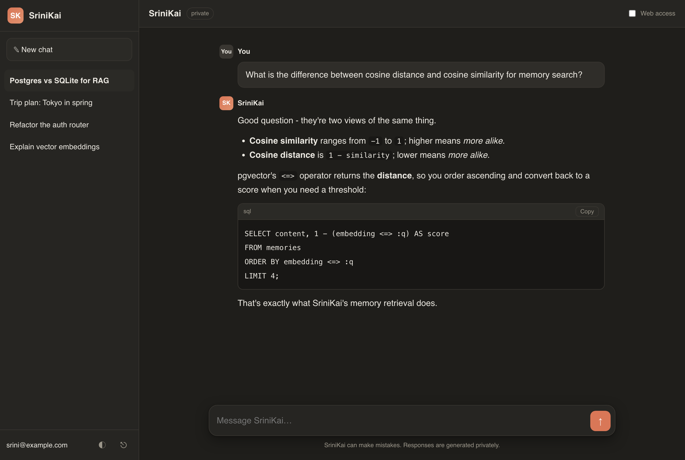
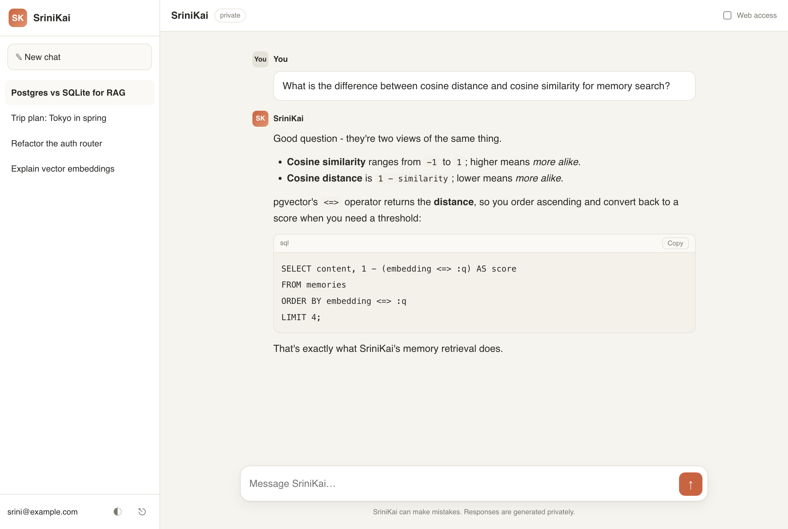

# SriniKai

A private, self-hosted LLM assistant. A polished chat UI and a hardened FastAPI
backend sit in front of a model that runs **entirely on your own machine** via
`llama-server` (llama.cpp). No third-party API keys, no data leaving your host.

The backend adds the things a raw model server does not: user accounts, persisted
conversations, long-term memory (RAG), optional web access, an MCP server that
exposes its tools to other clients, and a security layer around all of it.

---

## Architecture

Three moving parts: a static **frontend**, the **SriniKai API**, and the local
**model server**. The API is the only thing the browser talks to; it never
exposes the model server directly.

```
        ┌──────────────┐        ┌──────────────────────────────────┐        ┌──────────────────┐
        │   Frontend   │        │          SriniKai API            │        │   llama-server   │
        │ (static HTML)│        │            (FastAPI)             │        │   (llama.cpp)    │
        │              │        │                                  │        │                  │
        │  chat UI     │  HTTPS │  CORS + security headers         │  HTTP  │  Gemma weights   │
        │  JWT in      ├───────►│  rate limiting (per IP)          ├───────►│  runs locally,   │
        │  localStorage│  SSE   │  JWT auth -> current user        │◄───────┤  OpenAI-style    │
        │              │◄───────┤  chat proxy + context assembly   │ stream │  /v1/chat/...    │
        └──────────────┘        │  system-prompt injection         │        └──────────────────┘
                                └───┬───────────────┬──────────────┘
                                    │               │
                          ┌─────────▼──────┐   ┌────▼─────────┐
                          │  SQL store     │   │  Tools       │
                          │  users         │   │  web search  │
                          │  conversations │   │  fetch_url   │
                          │  messages      │   │  memory      │
                          │  memories      │   └──────────────┘
                          │  (SQLite/PG +  │
                          │   pgvector)    │
                          └────────────────┘
```

### Data flow of one chat turn

What happens between pressing Enter and the first token streaming back:

```
 1. Browser POST /api/chat   { message, conversation_id?, web?, temperature }
        │  Authorization: Bearer <JWT>
        ▼
 2. Security middleware  ──  CORS allowlist, security headers, per-IP rate limit
        ▼
 3. get_current_user     ──  decode + verify JWT, load the User (401 on failure)
        ▼
 4. Conversation         ──  resolve or create; ownership enforced by user_id
        ▼
 5. Persist user turn    ──  store the message, trim history to N recent turns
        ▼
 6. CONTEXT ASSEMBLY ────────────────────────────────────────────────┐
        │  a) embed(message) -> retrieve top-k user memories (RAG)    │
        │  b) if web=true   -> DuckDuckGo search + fetch top result   │
        │  c) store this message as a new long-term memory            │
        └──► build_messages(system_prompt + context + history + msg)  │
        ▼
 7. Proxy to llama-server  /v1/chat/completions  (stream=true)
        ▼
 8. Stream deltas back as SSE  ──  re-emit only content; strip upstream model ids
        ▼
 9. On completion  ──  persist the assistant turn, touch conversation.updated_at
```

The proxy is deliberately the only path to the model: it injects the hardened
**SriniKai** system prompt, trims history, and never forwards upstream model
identifiers to the client. See
[`routers/chat.py`](srinikai/backend/app/routers/chat.py) and
[`prompts.py`](srinikai/backend/app/prompts.py).

### Context and long-term memory (RAG)

Every user message is embedded and stored as a memory; on each turn the most
relevant memories are retrieved and injected into the system prompt.

```
   add_memory(msg)                         retrieve(query)
        │                                       │
   embed(text) ──► vector                   embed(query) ──► qvec
        │                                       │
        ▼                                       ▼
   ┌──────────────────────────┐         ┌───────────────────────────────┐
   │ memories table           │         │ Postgres: ORDER BY            │
   │  Postgres: pgvector col  │ ◄─────► │   embedding <=> qvec  (cosine)│
   │  SQLite:  JSON vector     │         │ SQLite: brute-force cosine    │
   └──────────────────────────┘         │ keep score >= memory_min_score│
                                         └───────────────────────────────┘
```

- **Embeddings** ([`embeddings.py`](srinikai/backend/app/embeddings.py)) call an
  OpenAI-compatible endpoint (`EMBEDDINGS_URL`, e.g. a second `llama-server
  --embeddings`). With none configured they fall back to a deterministic local
  hashing embedder so RAG always works offline (lower quality - swap in a real
  embedder for production).
- **Storage** ([`memory.py`](srinikai/backend/app/memory.py)) uses native
  `pgvector` with cosine distance on Postgres, and JSON vectors with in-Python
  cosine on SQLite for local dev.

### Credentials and security

```
   Registration / login
        │  email + password
        ▼
   argon2 hash ──► stored (never plaintext, never logged)
        │
        ▼
   create_access_token ──► JWT signed with JWT_SECRET (HS256, 7-day exp)
        │
        ▼
   Browser stores JWT in localStorage ; sends as  Authorization: Bearer
        │
        ▼
   get_current_user ──► decode + verify ──► load active User  (401 otherwise)
```

Guarantees enforced in code:

- Passwords hashed with **argon2**; verification is constant-time, rehash-aware.
- JWTs signed with `JWT_SECRET`; the app **refuses to boot in production** with
  the default secret ([`main.py`](srinikai/backend/app/main.py)).
- **CORS** restricted to an allowlist; strict security headers on every response.
- **Rate limits** on auth and chat endpoints; generic errors resist account
  enumeration and avoid leaking internals.
- Web fetch has an **SSRF guard** ([`web.py`](srinikai/backend/app/web.py)):
  blocks non-http(s) and private/loopback/link-local targets.
- Secrets live in `.env` (dev) or AWS Secrets Manager (prod), never in git.

### MCP server

The same tools the chat flow uses are exposed over the **Model Context Protocol**
([`mcp_server.py`](srinikai/backend/app/mcp_server.py)), so any MCP client
(Claude Desktop, IDEs, etc.) can call them directly:

```
   ┌────────────────┐   stdio (MCP)   ┌──────────────────────────────┐
   │  MCP client    │ ◄─────────────► │  python -m app.mcp_server    │
   │ (Claude / IDE) │                 │                              │
   └────────────────┘                 │  web_search(query)           │
                                      │  fetch_url(url)              │
                                      │  search_memory(email, query) │
                                      └──────────────────────────────┘
```

Register it in your MCP client with command `python`, args
`["-m", "app.mcp_server"]`, and `cwd = srinikai/backend` (so `.env` and the DB
resolve).

---

## Getting started

### 1. Clone and build llama.cpp (the model server)

This repo is built on llama.cpp; you only need a working `llama-server` binary.

```bash
git clone https://github.com/ggml-org/llama.cpp
cd llama.cpp
cmake -B build
cmake --build build --config Release -j   # produces build/bin/llama-server
```

For platform-specific builds (Metal, CUDA, etc.) see llama.cpp's
[`docs/build.md`](docs/build.md).

### 2. Start the model

`-hf` downloads the weights on first run (a small Gemma model here):

```bash
./build/bin/llama-server -hf ggml-org/gemma-3-1b-it-GGUF --port 8080
```

Optional second instance for higher-quality embeddings/RAG:

```bash
./build/bin/llama-server -hf <embedding-model-GGUF> --embeddings --port 8081
# then set EMBEDDINGS_URL=http://localhost:8081 in the API .env
```

### 3. Start the SriniKai API

```bash
cd srinikai/backend
python3 -m venv .venv && ./.venv/bin/pip install -r requirements.txt
cp .env.example .env          # then set a strong JWT_SECRET:
                              # python -c "import secrets; print(secrets.token_urlsafe(48))"
./.venv/bin/uvicorn app.main:app --reload --port 8000
```

Interactive API docs: http://localhost:8000/docs

### 4. Start the frontend

The frontend is a single static file - serve it over HTTP (not `file://`, so
CORS and `localStorage` behave) and open it:

```bash
cd srinikai/frontend
python3 -m http.server 8081
# open http://localhost:8081
```

By default it talks to `http://localhost:8000`. To point it elsewhere, set
`localStorage['sk-api']` in the browser console, or edit `const API =` in
`index.html`. Register an account, then chat - toggle **Web access** in the
header to let a turn search the internet.

### One-command stack (Docker)

Postgres + pgvector, the API, and the static frontend together (the model still
runs on the host and is reached via `host.docker.internal`):

```bash
cd srinikai
export JWT_SECRET="$(python3 -c 'import secrets; print(secrets.token_urlsafe(48))')"
docker compose up --build
# UI on http://localhost:8081 , API on http://localhost:8000
```

---

## API

| Method | Path                                 | Auth | Purpose                    |
|--------|--------------------------------------|------|----------------------------|
| GET    | `/api/health`                        | no   | liveness                   |
| POST   | `/api/auth/register`                 | no   | create account -> JWT      |
| POST   | `/api/auth/login`                    | no   | login -> JWT               |
| GET    | `/api/auth/me`                        | yes  | current user               |
| POST   | `/api/chat`                          | yes  | streaming chat (SSE)       |
| GET    | `/api/conversations`                 | yes  | list user's conversations  |
| GET    | `/api/conversations/{id}/messages`   | yes  | messages in a conversation |
| DELETE | `/api/conversations/{id}`            | yes  | delete a conversation      |

---

## Project layout

```
srinikai/
  backend/app/
    main.py        FastAPI app, middleware wiring, lifespan checks
    routers/       auth.py (register/login/me), chat.py (proxy + persistence)
    prompts.py     hardened SriniKai system prompt + message assembly
    memory.py      long-term memory: store + semantic retrieval (RAG)
    embeddings.py  embeddings provider (remote, with offline fallback)
    web.py         keyless web search + page fetch with SSRF guard
    mcp_server.py  MCP stdio server exposing the tools above
    security.py    argon2 hashing + JWT helpers
    config.py      settings (env / .env)
  frontend/        single-file chat UI (index.html)
  docs/screenshots/  UI screenshots + capture script
  DEPLOY.md        AWS deployment guide
  docker-compose.yml
```

More detail: [`srinikai/README.md`](srinikai/README.md) and the AWS deployment
guide in [`srinikai/DEPLOY.md`](srinikai/DEPLOY.md).

## Screenshots

|  Sign in  |  Chat (dark) |
|-----------|--------------|
|  |  |



> Screenshots are regenerated from the live frontend with
> [`srinikai/docs/screenshots/_capture.py`](srinikai/docs/screenshots/_capture.py)
> (headless Chrome, no backend required).

---

Built on [llama.cpp](https://github.com/ggml-org/llama.cpp). The upstream project
README is preserved in git history.
