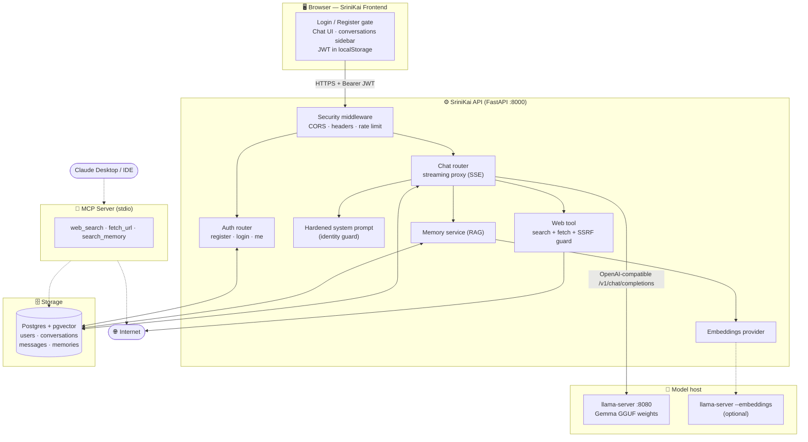
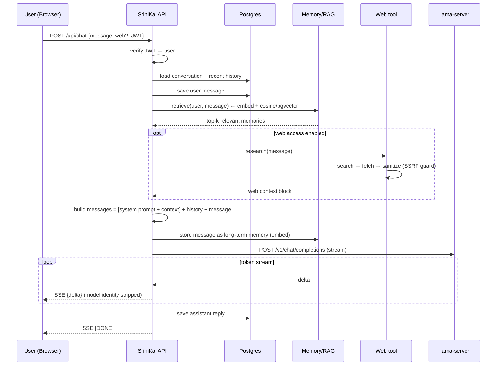
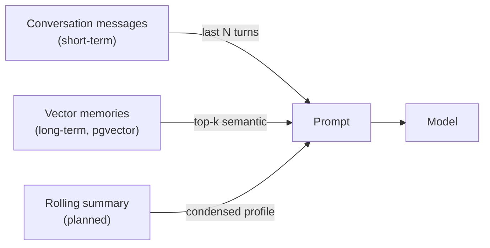
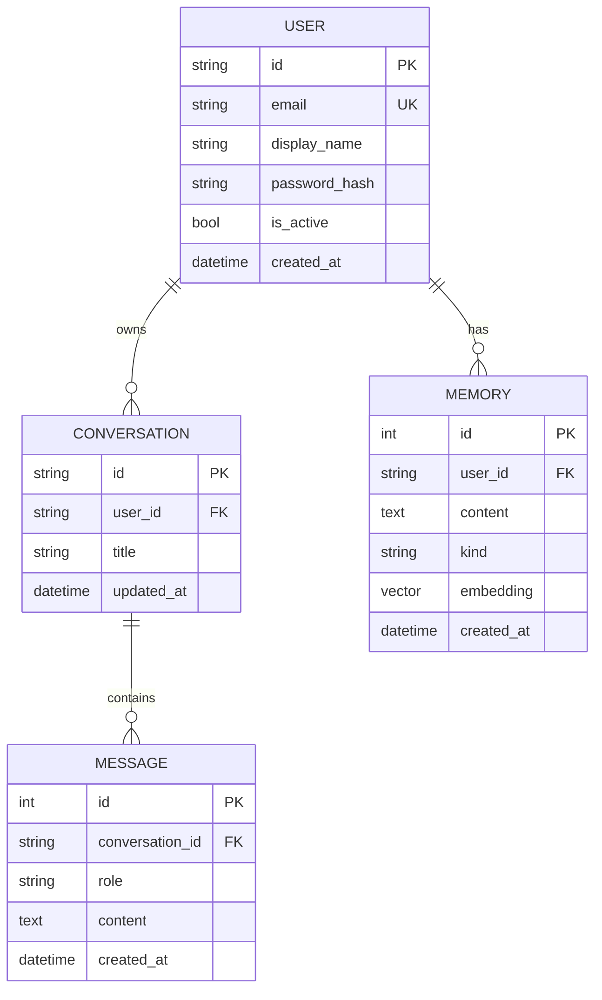
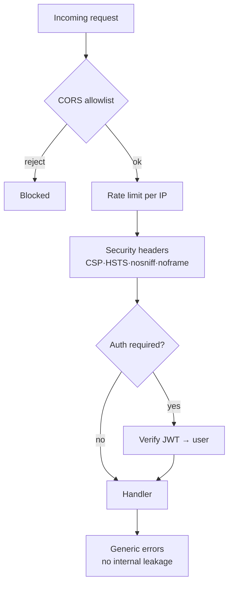

# SriniKai — Personal Private LLM Assistant

> A self-hosted, multi-user AI assistant built on top of `llama.cpp`.
> Accounts, persistent memory, semantic retrieval (RAG), internet access, an MCP
> tool server, a hardened identity, and an AWS deployment path — all private and
> running on your own machine/model.

This document summarises **everything that was built**, the **architecture**, and
the **data flow**. The application code lives in [`../srinikai/`](../srinikai/).

---

## 1. What was built (timeline)

The project grew in layered phases:

| Phase | Deliverable | Status |
|------:|-------------|:------:|
| 0 | Identified local model: Gemma-3-1B GGUF (806 MB, 340 tensors) in the HF cache | ✅ |
| 1 | **Simple webui** branded "SriniKai" talking to `llama-server` | ✅ |
| 2 | **Claude-style frontend** — markdown, code highlight, streaming, light/dark | ✅ |
| 3 | **Backend foundation** — FastAPI, accounts (argon2 + JWT), SQL persistence | ✅ |
| 4 | **Hardened system prompt** — concise, engaging, professional, hides identity | ✅ |
| 5 | **Frontend ↔ auth** — login/register gate, JWT, conversations sidebar | ✅ |
| 6 | **RAG** — embeddings provider + long-term memory + semantic retrieval | ✅ |
| 7 | **Internet access** — keyless web search + page fetch (with SSRF guard) | ✅ |
| 8 | **MCP server** — `web_search`, `fetch_url`, `search_memory` tools | ✅ |
| 9 | **Security layer** — CORS, headers, rate limiting, generic errors | ✅ |
| 10 | **AWS deploy** — Dockerfile, docker-compose, ECS/RDS/pgvector guide | ✅ |

### Verified working (end-to-end tests run)
- ✅ Register / login / `me`; unauthenticated calls rejected (401)
- ✅ Streaming chat persisted per user (user + assistant turns)
- ✅ **RAG recall**: taught "Rust / Austin", recalled both in a *fresh* chat with no history
- ✅ **Web access**: searched + fetched + grounded an answer about `llama.cpp`
- ✅ **SSRF guard**: blocks `localhost`/private IPs, allows public hosts
- ✅ **MCP**: all three tools listed and callable
- ✅ **Identity guard**: refuses to disclose the underlying model

---

## 2. Tech stack

| Layer | Choice | Why |
|-------|--------|-----|
| Model engine | `llama.cpp` (`llama-server`) | Local, OpenAI-compatible, runs the GGUF weights |
| Backend | **FastAPI** (Python) | Best ecosystem for LLM/RAG/MCP, async, easy AWS deploy |
| ORM / DB | SQLAlchemy + **SQLite (dev) / Postgres+pgvector (prod)** | One store for users, chats, AND vector memory |
| Auth | Email+password, **argon2** hashing, **JWT** sessions | Self-contained, no external dependency |
| Vectors | pgvector (prod) / JSON brute-force (dev) | Semantic retrieval without a second datastore |
| Tools | **MCP** (Model Context Protocol) | Standard tool interface for any MCP client |
| Frontend | Single-file HTML/JS, marked + DOMPurify + highlight.js | Zero build step, Claude-style UX |
| Deploy | Docker, docker-compose, ECS Fargate + RDS | Cloud-ready, secrets via Secrets Manager |

---

## 3. System architecture



<details>
<summary>ASCII fallback</summary>

```
 Browser (Frontend)                       AWS / Local Host
 ┌───────────────────┐
 │ Login / Register  │  HTTPS+JWT   ┌──────────────────────────────┐
 │ Chat + Sidebar    │ ───────────► │  SriniKai API (FastAPI)      │
 │ JWT in localStorage│             │  ┌────────────────────────┐  │
 └───────────────────┘             │  │ Security middleware     │  │
                                    │  │ (CORS/headers/ratelimit)│  │
                                    │  ├─ Auth router ───────────┤  │
                                    │  ├─ Chat router (SSE) ──────┤  │
                                    │  │   ├─ hardened prompt     │  │
                                    │  │   ├─ memory (RAG) ───────┼──┼──► Postgres+pgvector
                                    │  │   ├─ web tool ───────────┼──┼──► Internet
                                    │  │   └─ embeddings ─────────┼──┼─-► (embeddings srv)
                                    │  └──────────┬──────────────┘  │
                                    └─────────────┼─────────────────┘
                                                  │ /v1/chat/completions
                                                  ▼
                                         llama-server :8080 (Gemma GGUF)

 Claude Desktop / IDE  ──stdio──►  MCP server (web_search, fetch_url, search_memory)
```
</details>

---

## 4. Data flow — a single chat message



**Key guarantees in the flow**
- The browser **never** reaches `llama-server` directly — the API is the only path.
- The **system prompt + retrieved context** are injected server-side; the client can't override them.
- Upstream model identifiers are **stripped** before streaming to the client.
- Every memory write/read is **scoped to the authenticated user**.

---

## 5. Context strategy (how user context is saved)

Three complementary layers, all in SQL:



| Layer | Table | Purpose | Retrieval |
|-------|-------|---------|-----------|
| Short-term | `messages` | the active thread | last *N* turns |
| Long-term | `memories` (`embedding` vector) | cross-session facts/preferences | semantic top-k (cosine) |
| Summary *(planned)* | `memories.kind='summary'` | cheap always-on profile | always injected |

---

## 6. Database schema



---

## 7. Security layer



- **Passwords**: argon2 hashing, never logged or returned.
- **Sessions**: signed JWT; app **refuses to boot in prod** with the default secret.
- **Isolation**: clients never touch `llama-server`; model identity stripped.
- **SSRF**: web fetch blocks loopback/private/link-local addresses.
- **Enumeration resistance**: generic auth errors; rate-limited login/register.
- **Transport**: HSTS in prod; HTTPS-only behind ALB + ACM.

---

## 8. Repository map

```
srinikai/
├── README.md                  project readme + run instructions
├── DEPLOY.md                  AWS deployment guide (ECS/RDS/pgvector)
├── docker-compose.yml         local prod-like stack (db + api + web)
├── db/init.sql                enables pgvector extension
├── aws/ecs-task-def.json      Fargate task definition template
├── frontend/index.html        full app: auth + chat + sidebar
└── backend/
    ├── Dockerfile
    ├── requirements.txt          core deps
    ├── requirements-postgres.txt prod extras (psycopg, pgvector)
    ├── .env.example              config template
    └── app/
        ├── main.py            FastAPI app + middleware wiring
        ├── config.py          env-driven settings
        ├── database.py        engine/session (SQLite dev / Postgres prod)
        ├── models.py          User · Conversation · Message · Memory
        ├── schemas.py         request/response validation
        ├── security.py        argon2 + JWT
        ├── deps.py            current-user dependency
        ├── prompts.py         hardened SriniKai system prompt
        ├── memory.py          RAG store + retrieval
        ├── embeddings.py      embeddings provider (+ local fallback)
        ├── web.py             web search + fetch + SSRF guard
        ├── middleware.py      security headers
        ├── limiter.py         rate limiting
        ├── mcp_server.py      MCP tool server (stdio)
        └── routers/
            ├── auth.py        register · login · me
            └── chat.py        streaming chat + conversations
```

---

## 9. Running it locally

```bash
# 1) Model
./build/bin/llama-server -hf ggml-org/gemma-3-1b-it-GGUF --port 8080

# 2) API
cd srinikai/backend
python3 -m venv .venv && ./.venv/bin/pip install -r requirements.txt
cp .env.example .env        # set a strong JWT_SECRET
./.venv/bin/uvicorn app.main:app --reload --port 8000

# 3) Frontend
cd ../frontend && python3 -m http.server 5500
# open http://127.0.0.1:5500

# 4) (optional) MCP server
cd ../backend && ./.venv/bin/python -m app.mcp_server
```

API docs: http://localhost:8000/docs

---

## 10. API reference

| Method | Path | Auth | Purpose |
|--------|------|:----:|---------|
| GET | `/api/health` | — | liveness |
| POST | `/api/auth/register` | — | create account → JWT |
| POST | `/api/auth/login` | — | login → JWT |
| GET | `/api/auth/me` | ✅ | current user |
| POST | `/api/chat` | ✅ | streaming chat (SSE), RAG + optional web |
| GET | `/api/conversations` | ✅ | list user's conversations |
| GET | `/api/conversations/{id}/messages` | ✅ | thread messages |
| DELETE | `/api/conversations/{id}` | ✅ | delete a conversation |

---

## 11. Known limitations / next steps

- **Embeddings** currently use a deterministic local fallback (good pipeline,
  modest semantic quality). Set `EMBEDDINGS_URL` to a real embeddings server for prod.
- **Model size**: Gemma-3-1B is small — swap in a larger GGUF for stronger reasoning.
- **Web tool** is RAG-style (per-message toggle), not autonomous function-calling.
- **Planned**: rolling per-user summary, autonomous tool-calling, email verification,
  refresh tokens, Alembic migrations, WAF on the ALB.
```
